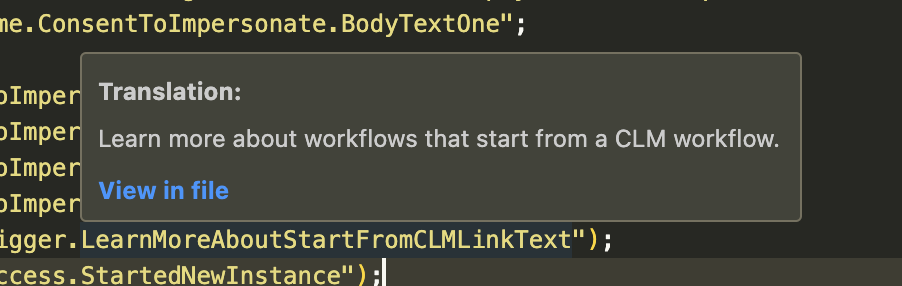

# Translation Reference for i18n JSON Files

For translation json files that have a nested hiearchy.

### Get Started

Use the settings to point to your translation .json file.

`"translation-reference-for-i18n-json.jsonFilePath"`

This path should be relative to your project. Example:

```
  {
    "translation-reference-for-i18n-json.jsonFilePath": "./myFiles/i18n/data.json";
  }
```

# Quickly reference what a translation variable text is.



# Copy new translation references created

# Search by the translation string to find any components that text exists within.

Use the command prompt (`Command+Shift+P`) and use the "Translation search" function. Enter in a string you are searching for and the results will be provided with any components that have a translation string that match your query.
