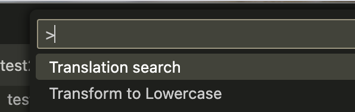
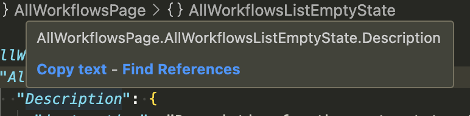
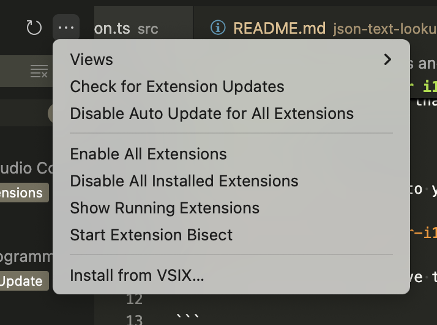

# Translation Reference for i18n JSON Files

For translation json files that have a nested hiearchy.

### Get Started

Use the settings to point to your translation .json file.

`"translation-reference-for-i18n-json.jsonFilePath"`

This path should be relative to your project. Example:

```
  {
    "translation-reference-for-i18n-json.jsonFilePath": "./myFiles/i18n/data.json"
  }
```

## Search by the translation string to find any components that text exists within.



Use the command prompt (`Command+Shift+P`) and use the "Translation search" function. Enter in a string you are searching for and the results will be provided with any components that have a translation string that match your query.

## Hover over translation to display the translation text


## Copy new translation references and search for references with your JSON file



Within the translation json file you can hover over a key to see the combined string of the parent keys. Copy this text with the "Copy text" button, and do a Find All search for components that reference this string.

#### Installing from VSIX

If you have the VSIX file you can install this by opening the "Extensions" panel in VSCode and choosing "Install from VSIX" from the sub-menu at the top of the sidebar.


